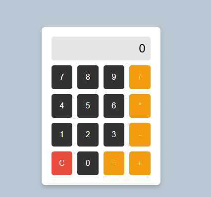

# Basic Calculator

A simple web-based calculator built with HTML, CSS, and JavaScript. This calculator performs basic arithmetic operations such as addition, subtraction, multiplication, and division.

## Features

- Perform basic arithmetic operations:
  - Addition (`+`)
  - Subtraction (`-`)
  - Multiplication (`*`)
  - Division (`/`)
- Clear the display with the `C` button
- Real-time display updates as you input numbers and operations
- Responsive and clean user interface

## Technologies Used

- **HTML5**: Structure of the calculator
- **CSS3**: Styling and layout for the calculator design
- **JavaScript**: Handling user interactions and performing calculations

## How to Use

1. Clone this repository to your local machine or download the project files.

    ```bash
    git clone https://github.com/muneebaifrah/calculator.git
    ```

2. Open the `index.html` file in your web browser.

3. Use the calculator by clicking the number buttons and operators:
   - Press a number button to input a number.
   - Press an operator (`+`, `-`, `*`, `/`) to choose an operation.
   - Press `=` to calculate the result.
   - Press `C` to clear the display and reset the calculator.


## Screenshots



## License

This project is licensed under the MIT License. See the [LICENSE](LICENSE) file for details.

## Contributing

Feel free to contribute to this project by submitting a pull request or opening an issue. All contributions are welcome!

## Acknowledgements

This calculator was built as a simple project to practice HTML, CSS, and JavaScript.